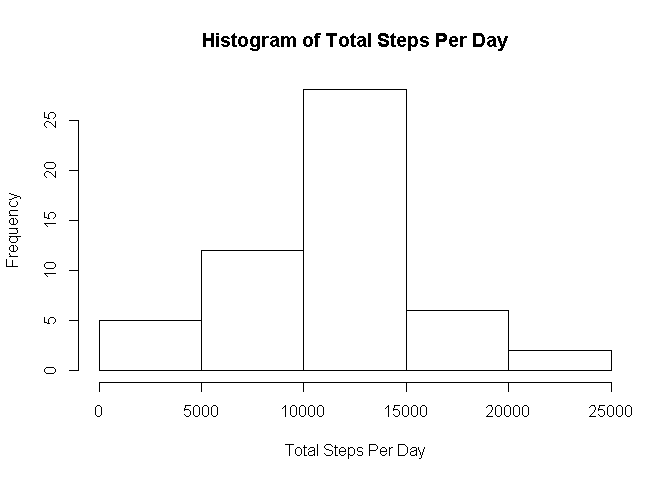
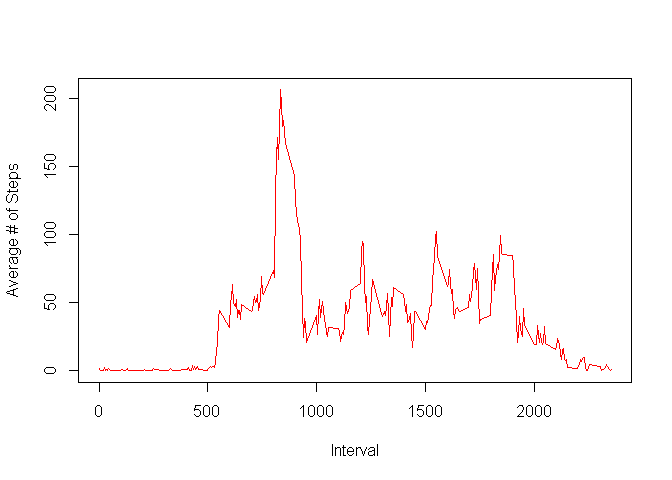
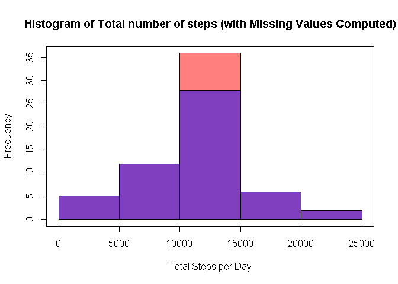
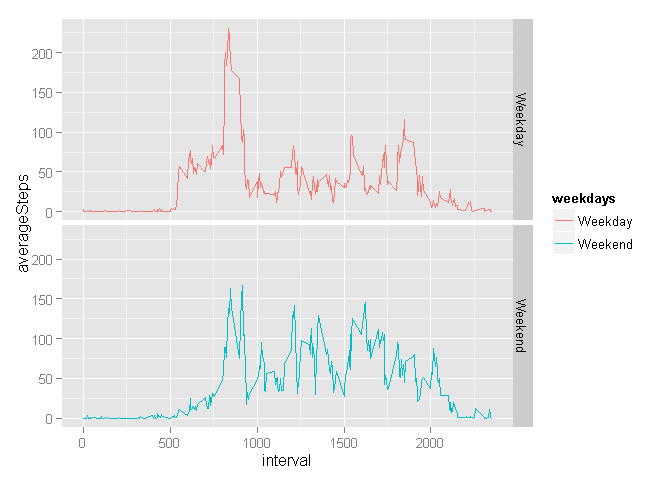

####PA1_Template

Author: Alice AN

Created: 2015-02-15

This file was created for a peer review assessment. 

Dataset: [Activity monitoring data](https://d396qusza40orc.cloudfront.net/repdata%2Fdata%2Factivity.zip)is stored in a comma-separated-value (CSV) file and there are a total of 17,568 observations in this dataset.

The variables included in this dataset are:

* steps: Number of steps taking in a 5-minute interval (missing values are coded as NA)

* date: The date on which the measurement was taken in YYYY-MM-DD format

* interval: Identifier for the 5-minute interval in which measurement was taken


####Loading and preprocessing the data

```r
unzip("activity.zip")
activityData<-read.csv("activity.csv")
library(dplyr)
Data<-activityData%>%mutate(date=as.character(date))%>%mutate(date=as.Date(date))
```


####Total number of steps taken per day
This section ignores the missing values in the dataset. This shows a histogram of the total number of steps taken each day and calculates the mean and median number of steps per day. 


```r
totalSteps<-Data%>%
        select(steps, date)%>%
        group_by(date)%>%
        summarize(totalSteps=sum(steps))


hist(totalSteps$totalSteps, xlab="Total Steps Per Day", main=paste("Histogram of Total Steps Per Day"))
```

 


```r
 median<-median(totalSteps$totalSteps, na.rm=TRUE)
 meanTotal<-as.integer(mean(totalSteps$totalSteps, na.rm=TRUE))
```


The mean number of total steps taken per day is 10766

The median number of total steps taken per day is 10765 


####What is the average daily activity pattern?

This plot attempts to explore an answer to the question:which 5-minute interval, on average across all the days in the dataset, contains the maximum number of steps? Missing values are ignored. 

```r
timeseries<-Data%>%
        group_by(interval)%>%
        summarize(averageSteps=mean(steps, na.rm=TRUE))
ranktimeseries<-timeseries[order(timeseries$averageSteps, decreasing=TRUE),]
IntervalwmostSteps<-ranktimeseries[1,1]

plot(timeseries$interval, timeseries$averageSteps, type="l", col="red", xlab="Interval", ylab="Average # of Steps")
```

 

The interval with most steps average across all days is 835 


####Imputing missing values

This calculates the total number of missing values (NAs) in the dataset 

```r
missingvalues<-length(is.na(Data))
```

The total number of missing values is 52704.

These missing values will be filled with the mean for that 5 minute interval. 


```r
newData<-Data %>% 
        group_by(interval) %>% 
        mutate(steps = ifelse(is.na(steps), 
                          as.integer(mean(steps, na.rm=TRUE)), 
                          steps))
```

With the missing values replaced, we'll create a histogram of the total number of steps taken each day. To show the effect of the NA replacement, we'll overlap the new Histogram in red, with the previous histogram (in blue). 


```r
newtotalSteps<-newData%>%
        select(steps, date)%>%
        group_by(date)%>%
        summarize(totalSteps=sum(steps))

hist(newtotalSteps$totalSteps, col=rgb(1,0,0,0.5), main="Histogram of Total number of steps (with Missing Values Computed)", xlab="Total Steps per Day")
hist(totalSteps$totalSteps, col=rgb(0,0,1,0.5), add=T)
box()
```

 

This calculates and reports the mean and median total number of steps taken per day using the data with the missing values replaced. 


```r
 newmedian<-median(newtotalSteps$totalSteps, na.rm=TRUE)
 newmeanTotal<-as.integer(mean(newtotalSteps$totalSteps, na.rm=TRUE)) 
```

The calculated mean number of total steps taken per day  without replacing NA values is 10766

The calculated mean number of total steps taken per day  with NA values replaced 10749

The calculated median number of total steps taken per day  without replacing NA values is 10765

The calculated median number of total steps taken per day  with NA values replaced 10641


####Compare the number of steps on weekdays and weekends

Create a factor variable for "weekday" and "weekend"

```r
dateData<-cbind(newData, weekdays=weekdays(Data$date))
dateData2<-dateData
levels(dateData2$weekdays)<-c("Weekday", "Weekday", "Weekend", "Weekend", "Weekday", "Weekday", "Weekday")
```

The code below creates a panel plot that compares the 5-minute interval (x-axis) and the average number of steps taken, averaged across all weekday days or weekend days (y-axis).

```r
panelData<-dateData2%>%
        group_by(interval, weekdays)%>%
        summarize(averageSteps=mean(steps))

library(ggplot2)
qplot(interval, averageSteps, data=panelData, colour=weekdays, facets=weekdays~., geom=c("line"))
```

 


